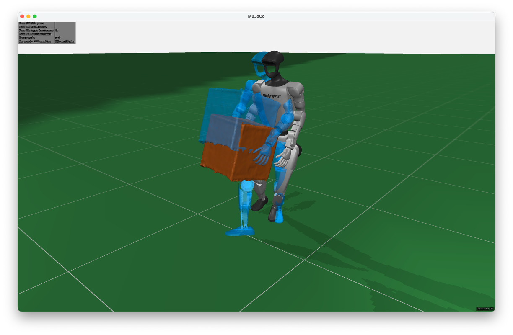

# Robot motion tracking

Tracks G1 motions with optional object interaction. The task follows the G1 whole-body tracking setup in [Holosoma](https://github.com/amazon-far/holosoma), with some adaptations.

Tracking an OMOMO clip in MuJoCo with the reference robot and object shown in blue:



| Environment | Physics | Algorithm | Data interface |
| ----------- | ----------- | ----------- | ----------- |
| `custom_mujoco.robot_motion_tracking.mujoco` | MuJoCo | `ppo.flax` | Numpy |
| `custom_mujoco.robot_motion_tracking.mjx_warp` | MJX Warp | `ppo.flax_full_jit` | JAX |

Set `environment.dataset=lafan` for robot-only tracking or `omomo` for robot and object tracking.

Set `environment.motion_files` to a quoted file pattern or a comma-separated list of NPZ paths. Use motions already retargeted to G1 rather than raw LAFAN BVH or human-only OMOMO data.

## Example motions

For a first run, download one of the retargeted motions below.
Run the commands in the RL-X Python environment and move the files from `/tmp/rlx_motions` to a permanent data directory to keep them for later.

### LAFAN

Start with `walk2_subject4` from the [LAFAN1 Retargeting Dataset](https://huggingface.co/datasets/lvhaidong/LAFAN1_Retargeting_Dataset). It is already retargeted to G1, so we just convert the downloaded CSV to NPZ for RL-X. The resulting file is about 1 MB and keeps all 7,146 frames at the original 30 Hz.

```bash
mkdir -p /tmp/rlx_motions
curl -fL "https://huggingface.co/datasets/lvhaidong/LAFAN1_Retargeting_Dataset/resolve/07ff8845a94d59d4195a8ac04fe918d4e6338239/g1/walk2_subject4.csv" -o /tmp/rlx_motions/lafan_walk2_subject4.csv
python - << "PY"
import numpy as np

qpos = np.loadtxt("/tmp/rlx_motions/lafan_walk2_subject4.csv", delimiter=",", dtype=np.float32)
np.savez_compressed("/tmp/rlx_motions/lafan_walk2_subject4.npz", qpos=qpos, fps=30, quaternion_order="xyzw")
PY
```

Add the following options to the experiment command. We enable `native_joint_order` because this CSV already matches our G1 joint order. Its root quaternion uses XYZW, which we recorded in the NPZ above so the loader can read it correctly.

```bash
--environment.dataset=lafan \
--environment.motion_files=/tmp/rlx_motions/lafan_walk2_subject4.npz \
--environment.native_joint_order=True
```

### OMOMO

For object interaction, use [Holosoma's G1 motion with a large box](https://github.com/amazon-far/holosoma/blob/fb835ec8cb6ee48f483ce567586625e5fae1ae1f/src/holosoma/holosoma/data/motions/g1_29dof/whole_body_tracking/sub3_largebox_003_mj_w_obj.npz) directly in RL-X.

```bash
mkdir -p /tmp/rlx_motions
HOLOSOMA_DATA="https://raw.githubusercontent.com/amazon-far/holosoma/fb835ec8cb6ee48f483ce567586625e5fae1ae1f/src/holosoma/holosoma/data"
curl -fL "$HOLOSOMA_DATA/motions/g1_29dof/whole_body_tracking/sub3_largebox_003_mj_w_obj.npz" -o /tmp/rlx_motions/omomo_largebox.npz
curl -fL "$HOLOSOMA_DATA/scene_objects/boxes/largebox.obj" -o /tmp/rlx_motions/largebox.obj
```

These options load the motion with the box mesh it was retargeted for.
There is no need to set `native_joint_order` here because the file includes the joint names.

```bash
--environment.dataset=omomo \
--environment.motion_files=/tmp/rlx_motions/omomo_largebox.npz \
--environment.object.type=mesh \
--environment.object.mesh_path=/tmp/rlx_motions/largebox.obj \
--environment.object.mass=0.1
```

## Motion format

To export custom robot motions, use `np.savez_compressed` with the fields below.
Express positions in metres with Z pointing up and joint angles in radians.
Each clip needs at least two frames without NaN or infinite values, and its quaternions must have unit length.

| Field | Format |
| ----------- | ----------- |
| `qpos` | Use `[T,36]` for LAFAN or `[T,43]` for OMOMO, where T is the number of frames. Each row contains robot position XYZ, root quaternion and 29 joint angles, followed by object position XYZ and quaternion for OMOMO. |
| `fps` | Store the frame rate as a positive scalar. Without this field, the loader uses `environment.motion_fps`. |
| `joint_names` | List the 29 G1 joint names as a string array in the order of the stored joint angles. This field can be left out if the angles already follow the native MuJoCo joint order and `environment.native_joint_order=True` is set. |
| `quaternion_order` | Set this scalar string to `wxyz` or `xyzw` for both robot and object. Without this field, the loader uses `environment.quaternion_order`, which defaults to `wxyz`. |

The [G1 model](https://github.com/nico-bohlinger/RL-X/blob/master/rl_x/environments/custom_mujoco/robot_motion_tracking/robots/unitree_g1/data/plane.xml) lists the joint names in their native order.
With joint names included, the loader puts the angles in the right order.
It also computes velocities and tracked body poses from `qpos` if the file does not include them.

With Holosoma's converted NPZ files, keep their existing fields instead of creating `qpos`.
Keep `joint_pos`, `joint_vel`, `body_pos_w`, `body_quat_w`, `body_lin_vel_w`, `body_ang_vel_w`, `body_names` and `joint_names`, along with `object_pos_w`, `object_quat_w` and `object_lin_vel_w` for OMOMO.

## Retargeting other motions

When starting from human motion rather than a robot trajectory, follow the [Holosoma retargeting guide](https://github.com/amazon-far/holosoma/blob/main/src/holosoma_retargeting/README.md) to retarget it to the 29-joint G1.
Choose `robot_only` with `lafan` for LAFAN.
For processed OMOMO, choose `object_interaction` with `smplh` so the retargeting also accounts for the robot's interaction with the object.

Once the motion is retargeted to G1, save it in the format above or run Holosoma's `data_conversion/convert_data_format_mj.py` to create a file RL-X can read.
For OMOMO, pass `--has_dynamic_object` and the matching `--object_name` so the converted file includes the object's motion too.
